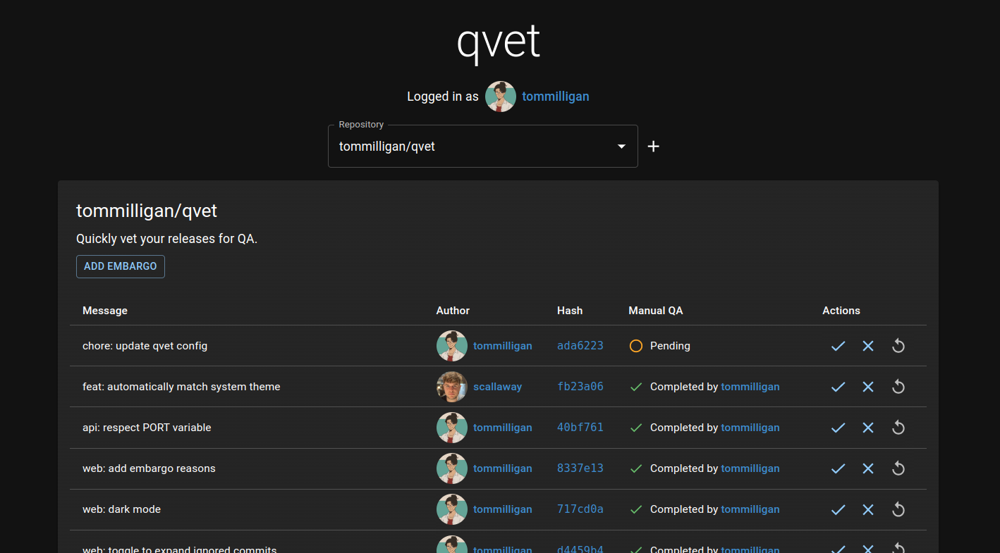

<p align="center">
  
  
  <h3 align="center">qvet</h3>

  <p align="center">
    Quickly vet your releases for QA.
  </p>
</p>

## Overview



`qvet` has two main components:

- `web`: The shiny dashboard UI. Most functionality is here.
- `api`: A lightweight backend, used where secrets are required.

All data is stored in Github, there is no additional persistent store/database required.

## Github App Configuration

### Permissions

- Commit statuses: Read and Write
  - To read and set QA status
- Contents: Read only
  - To read branches, commits and tags

### Events (currently not required)

- Create
  - To listen for a new tag (release) being created
- Push
  - To listen for new commits being pushed to master
- Status
  - To listen for QA statuses being updated

## Configuration

`qvet` reads a `qvet.yml` file from the root of the default branch of the
selected repository. See this repository's own [`qvet.yml`](./qvet.yml) for a
minimal example.

### Scheduled notices

Notices are banners shown at the top of the dashboard only while their schedule
is active. They are informational and do not affect whether a release is ready
to deploy. Use them for anything reviewers should be reminded of during a
recurring period, such as a release freeze or a period when extra care is
needed when signing off.

```yaml
notices:
  - title: "Release freeze"
    text: "Only changes that are safe to roll back should be released this week."
    url: "https://example.com/release-freeze-policy"
    severity: warning # info | warning | error (default: warning)
    schedule:
      start: "2030-03-04T09:00:00Z" # first time the notice becomes active
      duration: "P5D" # how long it stays active each time
      repeat_every: "P4W" # optional, omit for a one-off notice
      until: "2031-01-01T00:00:00Z" # optional, never active from this instant
```

- `start` and `until` are ISO 8601 timestamps and must include a timezone.
- `duration` and `repeat_every` are ISO 8601 durations, restricted to weeks,
  days, hours and minutes (for example `P2W`, `P3D`, `PT12H`, `P1DT6H`).
  Months and years are not supported as they have no fixed length.
- Schedules are evaluated in absolute time, so daylight savings changes do not
  shift when a notice is shown.

## Development

Start the two services in development/hot reload mode. Respectively:

- `web` with `cd qvet-web && npm install && npm run dev`
- `api` with `cd qvet-api && cargo watch -x 'run -- --bind 0.0.0.0:3000'`

_NOTE_

You'll need to make sure that `http://localhost` is mapped to an IPv4 address.
If it isn't, then the webapp won't be able to resolve the API correctly.

Check `/etc/hosts` for any keys that map to `localhost`.

## Standalone deployment

For convenience, `qvet` can run bundled in a single binary.

### Docker

For convenience, this binary is available in a thin docker image wrapper.

To build a new release, run `./qvet-standalone/scripts/build.sh`, which will produce an image named `qvet-standalone`.

This can then be invoked as follows:

```bash
docker run -d --rm --name ci-qvet --init -e GITHUB_CLIENT_ID -e GITHUB_CLIENT_SECRET -e QVET_COOKIE_KEY -p 39106:39105 qvet-standalone --bind 0.0.0.0:39105
```

#### Environment variables

| Environment Variable   | Example                           | Purpose                        | Notes                                                          |
| ---------------------- | --------------------------------- | ------------------------------ | -------------------------------------------------------------- |
| `GITHUB_CLIENT_ID`     | `Iv1.0123456789abcdef`            | Github App Client Id           | Required                                                       |
| `GITHUB_CLIENT_SECRET` | random hexadecimal, 40 characters | Github App Client Secret       | Required                                                       |
| `QVET_COOKIE_KEY`      | random hexadecimal, 64 characters | qvet private cookie encryption | Optional. If unset, a random key will be generated at runtime. |
